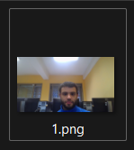

# Interfaces Inteligentes
## Práctica 7
### Diego Herrera Mendoza, Ginés Cruz Chávez, Adriano dos Santos Moreira
Micrófono y cámara

En esta práctica se ha pedido realizar varios ejercicios de scripting en Unity con C# con el fin de aprender a utilizar el micrófono y la cámara

1. Utiliza la escena con el zombie y activar la reproducción de alguno de los sonidos incluidos en la carpeta adjunta cuando alcanza a una araña.

https://github.com/DiegoHerrera2/ii-p7/assets/3327619/1631008c-7d2b-4607-98d9-880b5850f21d

---

2. Crea una escena en la que estés en un espacio abierto en el que habrá una pantalla central con altavoces que al pulsar la tecla R reproduzcan el sonido que se obtenga por el micrófono del dispositivo.

https://github.com/DiegoHerrera2/ii-p7/assets/3327619/95e1665f-e189-4104-9d44-949b21ba8830

Script Microphone: [Recorder.cs](scripts/Recorder.cs)

---

3. Utilizar lo que capta la cámara para reproducirlo en una pantalla ubicada en la escena anterior.

https://github.com/DiegoHerrera2/ii-p7/assets/3327619/95e1665f-e189-4104-9d44-949b21ba8830

Script CameraRecorder: [CameraRecorder.cs](scripts/CameraRecorder.cs)

---

4. Se debe mostrar el nombre de la cámara por consola

---

5. Debe ser posible capturar fotogramas aislados y conservarlos en memoria como imágenes fijas.

